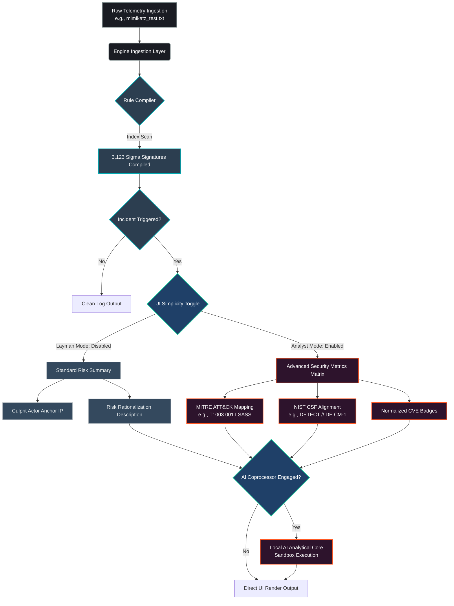

# SentinelLite // Modular Security Information & Event Management Framework

SentinelLite is a lightweight, high-performance, format-agnostic SIEM and log analysis utility built to process heterogeneous security telemetry. Operating as a pluggable triage pipeline, the framework ingests distinct structural log formats, cross-references logs against over 3,100+ native Sigma signature heuristics, compiles remediation sequences via an on-demand SOAR decision engine, and applies an asynchronous local AI coprocessor for contextual threat analysis.

The interface features an adaptive **UI Simplicity Toggle** designed to seamlessly bridge the gap between non-technical users and SOC analysts by filtering granular framework metrics on the fly.

---

### 🔄 System Data Architecture & Pipeline Flow

---

## 🚀 Key Architectural Layers

🚀 Key Architectural Layers

    Format-Agnostic Classifier & Parsing Core: Features an automated payload routing engine that inspects byte structures to identify telemetry schemas (Binary PCAP, Auth/SSHD Syslog, Nginx Web Logs, and Structured JSON) with line-by-line exception isolation to survive malformed streams.

    3,123-Signature Sigma Compilation Matrix: Compiles thousands of community-standard rule-sets directly into an active in-memory map at runtime, validating complex nested MITRE ATT&CK sub-techniques (e.g., T1003.001) and standardizing multi-format CVE structures instantly.

    Automated SOAR Decision Engine: Generates real-time, copy-pasteable terminal mitigation scripts (iptables drops, routing blocks, process isolation) immediately upon signature matches to optimize Mean Time to Respond (MTTR).

    Local AI Analytical Coprocessor: Integrates with local model environments via zero-dependency APIs to perform on-demand tactical reviews of complex attack sequences without leaking sensitive corporate telemetry data to third-party commercial cloud endpoints.

🛠️ Workspace Setup & Deployment

Choose the installation method that matches your engineering requirements:
Option A: The One-Click Desktop Deployment (Non-Technical Users)

Ideal for standard review environments that do not require raw Python file alterations.

    Download and unzip the SentinelLite.zip deployment package.

    Double-click Launch Dashboard.bat.

    The local analytical engine will spin up, compile signature catalogs, and automatically snap open your system's default browser directly to the dashboard canvas at http://127.0.0.1:5000.

Option B: The Developer Environment (Advanced Setup)
Prerequisites

    Python 3.8+

    Local administrative privileges (required for high-precision network packet capture bindings)

    1. Clone & Prepare Environment
        git clone [https://github.com/your-username/sentinel-lite.git](https://github.com/your-username/sentinel-lite.git)
        cd sentinel-lite

    2. Establish Virtual Environment & Dependencies
        # Create and activate environment
        python -m venv venv
        source venv/bin/activate  # On Windows use: venv\Scripts\activate
        # Install third-party framework dependencies
        pip install -r requirements.txt

    3. Run the Local AI Engine (Optional Integration)

        If utilizing the local analytical coprocessor feature, verify that your local instance is active and reachable via your environment's local loopback:
        ollama run llama3  # Or your specifically mapped local model target

    4. Launch the Server
        python app.py
        Open your web browser and navigate to: http://127.0.0.1:5000

📁 Directory Architecture
Plaintext

sentinel_lite/
│
├── app.py                     # Flask Main Application Core & Worker Routine Initializer
├── requirements.txt           # Framework Third-Party Application Dependencies
├── README.md                  # System Documentation Matrix
├── Launch Dashboard.bat       # Asynchronous 1-Click Startup Automation Script
│
├── sigma_rules/               # Dynamic Signature Database Repository (3,123+ YAML Rules)
│   ├── application/
│   ├── category/
│   ├── cloud/
│   ├── identity/
│   └── linux/
│
├── core/                      # Analytical Engine Logic Packages
│   ├── __init__.py
│   ├── parsers.py             # Line-Isolated Ingestion Parsers (PCAP, Syslog, Web, JSON)
│   ├── rules_engine.py        # Resilient Regex-Driven Threat Intel Integration (MITRE / CVE)
│   └── soar.py                # Automated Playbook Generation & Remediation Compilers
│
├── artifacts/                 # Volatile System Run Data
│   └── playbooks/             # Hot-Compiled Operational Defense Scripts
│
├── templates/                 # UI Presentation Layer
│   └── index.html             # Minimalist Dashboard Frontend (Featuring Simplicity Toggle)
│
└── static/                    # Layout Customizations & UI Assets

🔒 Production Security Standard

    Line-Level Invalidation Isolation: Every log parser enforces strict local try-except contexts per element row. If a single line contains corrupt data or anomalous byte injections, that row is safely flagged and dropped without compromising the runtime state of the active analysis cycle.

    Zero External Overhead: Telemetry logs and packet matrices are parsed entirely inside volatile memory constraints, and AI classification runs strictly on local hardware scopes. No operational data or cryptographic hashes are ever transmitted to external nodes or commercial cloud APIs.

Key Improvements Made:

    Added the Dual-Onboarding Path: Documented the .bat file installation path right beside the raw developer python commands, ensuring any profile of user knows exactly how to light up the application.